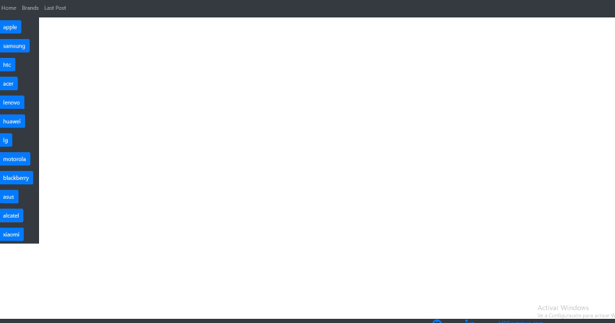

# vue-spring-boot-app

Second attempt on web with a simple Spring boot api rest powered by Vue.js.

## Setting up:

To run it locally all you need to do is:
- Download and install docker.
- Download ```docker-compose.yml``` from this repo.
- Make sure ports 3306, 8080 and 8081 are free in host machine.
- Run ```docker-compose up``` . (There is a lot going on here, it may take a while.. specially front)

## how to use:

There are serveral URLs you can access:
- (from browser) ``` http://localhost:8081 ``` -> Vue client.
- (from browser) ``` http://localhost:8080 ``` -> Spring boot api.
- (mysql-server) ``` http://localhost:3306 ``` -> MySql db.

Have fun! everybody loves gifs..


